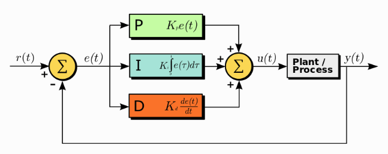

# PID Algorithm

From https://www.omega.co.uk/prodinfo/how-does-a-pid-controller-work.html

## Basics
PID algorithm is used to control a process variable by combining proportional control with complimentary integral and derivative adjustements to automatically compensate for changes in the system. The sole purpose of the PID controller is to achieve a target setpoint for a process variable by forcing the feedback to match that setpoint

PID Controllers are best implemented in:
 - highly responsive systems (low mass)
 - systems with a high number of load changes

### PID Functional Components
1. Proportional tuning involves correcting a target proportional to the difference. Thus, the target value is never achieved because as the difference approaches zero, so too does the applied correction.
2. Integral tuning attempts to remedy this by effectively cumulating the error result from the "P" action to increase the correction factor. For example, if the oven remained below temperature, “I” would act to increase the head delivered. However, rather than stop heating when the target is reached, "I" attempts to drive the cumulative error to zero, resulting in an overshoot.
3. Derivative tuning attempts to minimize this overshoot by slowing the correction factor applied as the target is approached.

## Tuning Parameters
`kp` `ki` and `kd` are the tuning parameters for each component and represent the relative weights of each component.